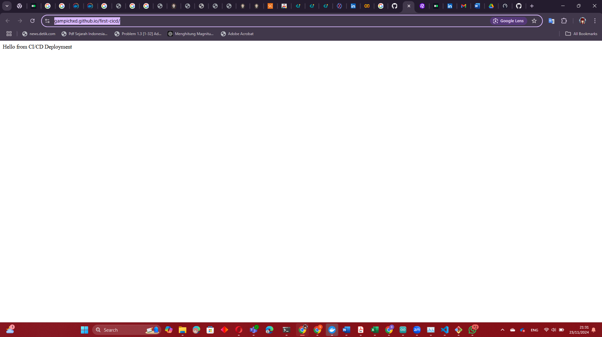

# CI/CD Pipeline untuk Proyek Node.js

## **Pipeline CI**
Pipeline CI dikonfigurasi untuk:
- Menginstal dependensi.
- Menjalankan pengujian otomatis.
- Menampilkan status keberhasilan atau kegagalan pada GitHub Actions.

### **File Workflow CI: `.github/workflows/ci.yml`**
```yaml
name: Continuous Integration
on:
  push:
    branches:
      - main
  pull_request:
    branches:
      - main

jobs:
  test:
    runs-on: ubuntu-latest
    steps:
      - name: Checkout code
        uses: actions/checkout@v3
      - name: Setup Node.js
        uses: actions/setup-node@v3
        with:
          node-version: 16
      - name: Install dependencies
        run: npm install
      - name: Run tests
        run: npm test
```

---

## **Pipeline CD**
Pipeline CD dikonfigurasi untuk:
- Secara otomatis melakukan deployment ke GitHub Pages setelah pipeline CI berhasil.

### **File Workflow CD: `.github/workflows/cd.yml`**
```yaml
name: Continuous Deployment
on:
  push:
    branches:
      - main

jobs:
  deploy:
    runs-on: ubuntu-latest
    needs: test
    steps:
      - name: Checkout code
        uses: actions/checkout@v3
      - name: Setup Node.js
        uses: actions/setup-node@v3
        with:
          node-version: 16
      - name: Build project
        run: |
          npm run build
          mkdir -p out
          echo "Hello from CI/CD Deployment" > out/index.html
      - name: Deploy to GitHub Pages
        uses: peaceiris/actions-gh-pages@v3
        with:
          github_token: ${{ secrets.YOUR_SECRET_KEY }}
          publish_dir: ./out
```

---

## **Link Deployment**
Aplikasi telah di-*deploy* ke GitHub Pages pada tautan berikut: **[https://gampichxd.github.io/first-cicd/](#)**

---

## **Screenshot Pipeline CI**
Lampiran tangkapan layar dari proses pipeline CI untuk menunjukkan apakah berhasil.

--- 

Penulisan README ini bertujuan untuk memberikan panduan dan dokumentasi lengkap terkait proses CI/CD pada proyek Node.js Anda.